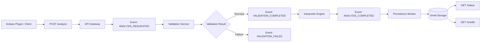

# SmellHunter API

Event-driven API for detecting code smells using metrics analysis and a Domain Specific Language (DSL).

## Table of Contents

1. [Research Motivation](#research-motivation)
   - [Problem](#problem)
   - [Research Gap](#research-gap)
   - [Proposed Approach](#proposed-approach)

2. [Architecture](#architecture)

3. [Detection Workflow](#detection-workflow)

4. [API Endpoints](#api-endpoints)
   - [POST analyze](#post-analyze)
   - [GET status](#get-statusctx_id)
   - [GET smells](#get-smellssmell_id)

5. [Event Flow](#event-flow)

6. [Response Codes](#response-codes)

7. [Observers Overview](#observers-overview)

8. [Setup Guide](#setup-guide)
   - [Prerequisites](#prerequisites)
     - [Python Environment](#python-environment)
     - [Install Dependencies](#install-dependencies)
     - [Google Sheets Setup](#google-sheets-setup)
9. [Running the Application](#running-the-application)

10. [Eclipse Plugin Setup](#eclipse-plugin-setup)
    - [Requirements](#requirements)
    - [Import Plugin Project](#import-plugin-project)
    - [Build and Run](#build-and-run)

11. [Data Visualization](#data-visualization)
    - [Overview](#overview)
    - [Physical Context View](#physical-context-view)
    - [Smell Details View](#smell-details-view)

12. [Feature Engineering & Forecasting](#feature-engineering--forecasting)

- [Overview](#overview-features)
- [Feature Definitions](#feature-definitions)
- [Forecasting: Project-level](#forecasting-project-level)

## Research Motivation

### _Problem_

Code smells are internal structures in source code that violate coding conventions and design principles, harming the internal quality of evolving systems and indicating issues of architectural and design degradation.

They typically arise when developers make hurried or poorly planned modifications to implement features or fix problems.

### _Research Gap_

Traditional detection approaches focus mainly on static analysis and predefined technical metrics. However, such approaches often ignore important aspects of the development context, such as team characteristics, project constraints, and the stage of software evolution.

### _Proposed Approach_

Unlike traditional detection approaches, **SmellHunter integrates technical metrics alongside development context**.

The tool supports **asynchronous analyses**, reducing interference with the developer’s workflow while enabling scalable and incremental processing.

This approach aims to **reduce false positives** and helps in **refactoring decisions aligned with real-world development contexts**.

## Architecture


The system uses an event bus pattern with the following event types:

- `ANALYSIS_REQUESTED`

- `VALIDATION_COMPLETED` / `VALIDATION_FAILED`

- `ANALYSIS_COMPLETED`

- `PERSISTENCE_COMPLETED`

## Detection Workflow



## API Endpoints

### `POST /analyze`

Initiates asynchronous smell analysis.

Request Format: `multipart/form-data` or `application/json`

#### Required Parameters (multipart/form-data):

| Field      | Type   | Required | Description                             |
| ---------- | ------ | -------- | --------------------------------------- |
| user_id    | string | Yes      | User identifier                         |
| smell_dsl  | file   | Yes      | `.smelldsl` file with smell definitions |
| metrics    | file   | Yes      | CSV/JSON file with metric values        |
| thresholds | file   | Yes      | CSV/JSON file with threshold values     |

### Optional Parametes

| Field      | Type   | Required | Description         |
| ---------- | ------ | -------- | ------------------- |
| loc_id     | string | Yes      | Location identifier |
| project_id | string | Yes      | Project identifier  |
| org_id     | string | Yes      | Company identifier  |

#### File Formats:

## `metrics.csv`

```
Metrica,Valor
GodClass.ATFD,12
GodClass.TCC,4
LongMethod.LOC,300
```

## `thresholds.csv`

```
Metrica,Valor
GodClass.ATFD-LIMIT,10
GodClass.TCC-LIMIT,5
LongMethod.LOC-LIMIT,100
```

## `smelldsl`:

```
smelltype DesignSmell;
smell GodClass extends DesignSmell {
    feature ATFD with threshold 4, 10;
    feature TCC with threshold 3, 5;
    treatment "Refactor into smaller classes";
}
rule GodClassRule when (GodClass.ATFD > GodClass.ATFD-LIMIT) then "Flag";
```

#### JSON Request (alternative):

```
{
  "user_id": 3,
  "smell_dsl": "smelltype DesignSmell; smell GodClass extends...",
  "metrics": {
    "GodClass.ATFD": 12,
    "GodClass.TCC": 4
  },
  "thresholds": {
    "GodClass.ATFD-LIMIT": 10,
    "GodClass.TCC-LIMIT": 5
  },
  "request_data": {
    "org_id": 2,
    "loc_id": 3,
    "project_id": 1,
    "file_path": "/src/Main.java",
    "language": "java",
    "branch": "main",
    "commit_sha": "abc123"
  }
}
```

#### Response (202 Accepted):

```
{
  "status": "accepted",
  "ctx_id": "550e8400-e29b-41d4-a716-446655440000",
  "smell_id": "6ba7b810-9dad-11d1-80b4-00c04fd430c8"
}
```

### `GET /status/<ctx_id>`

Check analysis status.

#### Response (processing):

```
{
  "status": "processing"
}
```

#### Response (completed):

```
{
  "status": "ok",
  "history": [
    {
      "cod_ctx": "550e8400-e29b-41d4-a716-446655440000",
      "status": "INTERPRETED",
      "details": "{\"result\": {\"is_smell\": true, \"smells_detected\": [\"GodClass\"]}}"
    }
  ]
}
```

### `GET /smells/<smell_id>`

Retrieve persisted smell data.

#### Response (200 OK):

```
{
  "id": "6ba7b810-9dad-11d1-80b4-00c04fd430c8",
  "ctx_id": "550e8400-e29b-41d4-a716-446655440000",
  "timestamp_utc": "2024-01-01T12:00:00.000Z",
  "user_id": "123",
  "org_id": "456",
  "loc_id": "789",
  "project_id": "101",
  "type": "GodClass",
  "smell_type": "DesignSmell",
  "is_smell": true,
  "rule": {"GodClassRule": true},
  "file_path": "/src/Main.java",
  "language": "java",
  "branch": "main",
  "commit_sha": "abc123",
  "treatment": "Refactor into smaller classes",
  "metrics": {
    "GodClass.ATFD": 12,
    "GodClass.TCC": 4
  }
}
```

## Event Flow

1.  Eclipse Plugin Client → `POST /analyze`

2.  API generates `ctx_id` and `smell_id`

3.  Event `ANALYSIS__REQUESTED` published

4.  ValidationObserver validates metrics and thresholds

5.  Event `VALIDATION_COMPLETED` published

6.  InterpreterWorker executes `run_interpretation()`

7.  Event `ANALYSIS_COMPLETED` published

8.  PersistenceWorker saves to local CSV

9.  Event `PERSISTENCE_COMPLETED` published

10. SheetsPersistenceObserver saves to Google Sheets

11. StatusWorker stores result for status queries

12. Client polls `GET /status/<ctx_id>` and `GET /smells/<smell_id>`

## Response Codes

| Code | Description                          |
| ---- | ------------------------------------ |
| 202  | Analysis accepted (async processing) |
| 400  | Bad request (invalid data)           |
| 404  | Resource not found                   |
| 500  | Internal server error                |

## Observers Overview

| Observer                  | Event                 | Responsibility            |
| ------------------------- | --------------------- | ------------------------- |
| ValidationObserver        | ANALYSIS_REQUESTED    | Starts the pipeline       |
| InterpreterWorker         | VALIDATION_COMPLETED  | Executes interpretation   |
| PersistenceWorker         | ANALYSIS_COMPLETED    | Saves to CSV              |
| SheetsPersistenceObserver | PERSISTENCE_COMPLETED | Saves to Google Sheets    |
| StatusWorker              | ANALYSIS_COMPLETED    | Stores for status queries |
| LogObserver               | ANALYSIS_COMPLETED    | Saves log file            |
| CsvSheetsObserver         | ANALYSIS_COMPLETED    | Exports to CSV            |
| EventBusLoggerObserver    | All                   | Logs context events       |

# Setup Guide

## Reproducibility Video

[](https://youtu.be/WKONlb5o1TY)
🔗 **[Link](https://youtu.be/Q290D5Pgew0)**

## Complete Step-by-Step Installation

## Prerequisites

### Python Environment

#### Python 3.9+ required

```
python --version  # Verify version
```

## Create virtual environment (recommended)

```
python -m venv venv
```

## Activate virtual environment

```
# Windows:
venv\Scripts\activate
# Linux/Mac:
source venv/bin/activate
```

---

### Install Dependencies

---

### Google Sheets Setup

#### 3.1 Create Google Cloud Project

1.  Go to [Google Cloud Console](https://console.cloud.google.com/)

2.  Create new project or select existing

3.  Enable Google Sheets API

#### 3.2 Create Service Account

1.  Navigate to IAM & Admin → Service Accounts

2.  Click Create Service Account

3.  Name: `(...)`

4.  Assign role: Editor

5.  Create key: JSON format

6.  Download and save as `service-account.json` in project root

### 3.3 Google Sheets Setup

1. Download the pre-configured spreadsheet:
   - Access the shared Google Drive template:

     🔗 **[SmellHunter Database Template](https://docs.google.com/spreadsheets/d/1mYoiaN0SBuAhNZgl-2trXicUmo2pxkHMTsYyr1uPRMo/edit?usp=sharing)**

   - Click "Make a copy" to save it to your own Google Drive

   - Rename it as needed (e.g., "SmellHunter - [Your Project Name]")

2. Worksheet Structure (already configured):
   - Bad_Smell - Contains all detected smells with complete metadata

   - Context - Logs all context events and execution history

3. Share with Service Account:
   - Open your copied spreadsheet

   - Click the "Share" button in the top-right corner

   - Add your service account email (found in `service-account.json`)

   - Assign role: Editor

   - Uncheck "Notify people" and click Share

4. Get Spreadsheet ID:
   - The spreadsheet URL contains the ID:\
     `https://docs.google.com/spreadsheets/d/``SPREADSHEET_ID_HERE``/edit`

   - Copy this ID and add it to your `.env` file:

```
        SPREADSHEET_ID=YOUR_SPREADSHEET_ID
        GOOGLE_APPLICATION_CREDENTIALS=app/configs/service_account.json
```

5.  Verify Headers (already set up):

    Bad_Smell worksheet headers:

```
   id, timestamp_utc, time_zone, user_id, org_id, loc_id, project_id, type, smell_type, is_smell, rule, file_path, language, branch, commit_sha, ctx_id, treatment
```

Context worksheet headers:

```
    ctx_id, user_id, org_id, loc_id, timestamp_utc, event_type
```

The spreadsheets are now ready to receive data from your SmellDSL Detection Service!

### 4\. Configuration File

Create `.env` file in project root:

#### Flask settings

```
FLASK_ENV=development
FLASK_APP=interpreter_api.py
PORT=5000
```

#### Google Sheets

```
SPREADSHEET_ID=your-spreadsheet-id-here
SERVICE_ACCOUNT_FILE=service-account.json
```

#### Logging

```
LOG_DIR=logs
```

### 5\. Project Structure

```
smell-detect/
├── app/
│   ├── configs/
│   │   └── settings.py
│   ├── events/
│   │   ├── event_bus.py
│   │   ├── event_types.py
│   │   ├── observers.py
│   │   └── validation_service.py
│   ├── parser/
│   │   ├── grammar.py
│   │   └── metric_extractor.py
│   ├── repositories/
│   │   └── sheets_repository.py
│   ├── interpreter_api.py
│   ├── interpreter_core.py
│   └── __init__.py
├── logs/
├── service-account.json
├── .env
└── requirements.txt
```

### 6\. pip install requirements.txt

```
#Core dependencies
flask==2.3.3
lark==1.2.2

#Google Sheets integration
google-api-python-client==2.108.0
google-auth==2.28.1
google-auth-httplib2==0.2.0
google-auth-oauthlib==1.2.0
google-oauth2==1.0.0


#Utilities
python-dotenv==1.0.0
requests==2.31.0
dataclasses==0.6  # For Python < 3.7 (optional)
typing-extensions==4.9.0

#Development tools (optional)
pytest==7.4.4
black==23.12.1
flake8==7.0.0
```

## Running the Application

### 1\. Start the API Server

```
cd smelldetect
python -m app.interpreter_api
```

## Eclipse Plugin Setup

🔗[**SmellHunter Eclipse Plugin**](https://github.com/MathDEV-0/SmellHunter-Eclipse-Plugin.git)

###  Requirements

- Eclipse IDE 2023-12 or later

- JDK 21 or later

- SWT libraries (included with Eclipse)

### Import Plugin Project

1.  File → Import → Existing Projects into Workspace

2.  Select the plugin project directory

3.  Check "Search for nested projects"

4.  Click Finish

### Build and Run

1.  Right-click on the project → Run As → Eclipse Application

2.  A new Eclipse instance will launch

3.  Navigate to Window → Show View → Other...

4.  In the dialog, expand the plugin category and select "MyView"

5.  Click Open to display the view

## Data Visualization

### Overview

SmellHunter persists detected smells and contextual execution data in Google Sheets.  
These datasets can be connected to AppSheet to provide an interactive visualization layer for exploring detection results.

## The dashboard allows users to inspect detected smells, navigate contextual information, and analyze detection outcomes through a structured interface.

🔗[**SmellHunter AppSheet Mobile View**](https://www.appsheet.com/newshortcut/2add826f-5f42-4c47-9188-89bac62978e4)

🔗[**SmellHunter AppSheet Browser View**](https://www.appsheet.com/start/2add826f-5f42-4c47-9188-89bac62978e4)

---

### Physical Context View

This view presents contextual information related to the execution environment where the analysis occurred.  
It includes metadata such as organization identifiers, project information, location identifiers, and execution timestamps.

The goal of this view is to support contextual analysis of smell occurrences across different projects and development environments.


---

### Smell Details View

The Smell Details view displays the complete information related to a detected smell instance.  
This includes the smell type, evaluated rule results, associated metrics, and metadata describing the analyzed artifact.

This view helps developers understand why a smell was detected and provides insights to guide refactoring decisions.


## Feature Engineering & Forecasting

=================================

### Overview (Features)

---

SmellHunter goes beyond static detection by incorporating **temporal and contextual features** extracted from development activity.

These features are used for:

- Context-aware smell analysis
- Historical behavior tracking
- Forecasting future smell occurrences

The dataset is structured as a time-series of development events, where each row represents a contextual snapshot of a smell evaluation.

## Feature Definitions (Computation Details)

---

This section describes **how each feature is computed internally**, including aggregation logic, mathematical definitions, and preprocessing transformations.

---

## Data Preparation

Before feature extraction, the following preprocessing steps are applied:

### Duplicate Removal

Rows are deduplicated based on `ctx_id`:

df = df.drop_duplicates(subset=['ctx_id'])

### Normalization of `is_smell`

The `is_smell` field is converted to numeric and invalid values are handled:

is_smell = to_numeric(is_smell, errors="coerce").fillna(0)

This ensures:

is_smelli∈{0,1}is_smell_i \in \{0, 1\}is_smelli​∈{0,1}

### Timestamp Processing

timestamp → datetime\
date = timestamp.date()

This enables daily aggregation.

---

## Core Target Variable

### Daily Smell Count (`y`)

This is the **main variable used for forecasting**.

yd=∑i∈dis*smelliy_d = \sum*{i \in d} is_smell_iyd​=i∈d∑​is_smelli​

Where:

- ddd = a specific day
- is_smelli∈{0,1}is_smell_i \in \{0,1\}is_smelli​∈{0,1}

Implementation:

df.groupby(['project_id', 'date'])['is_smell'].sum()

---

## Time Series Construction

### Aggregation

Data is grouped by:

- `project_id`
- `date`

Result:

(project_id,date)→yd(project_id, date) \rightarrow y_d(project_id,date)→yd​

---

### Filling Missing Dates (Critical)

A continuous daily time series is enforced:

full_range = date_range(min_date, today)\
df = df.reindex(full_range).fillna(0)

Meaning:

yd=0if no data exists for day dy_d = 0 \quad \text{if no data exists for day } dyd​=0if no data exists for day d

This avoids temporal bias and ensures consistency for forecasting models.

---

## Forecasting Features

### Bootstrap-Based Estimation

Each forecast value is computed as:

y^=μwindow+ϵ\hat{y} = \mu\_{window} + \epsilony^​=μwindow​+ϵ

Where:

- μwindow\mu\_{window}μwindow​ = mean of a sampled historical window (size ≤ 7 days)
- ϵ∼N(0,0.3⋅σ)\epsilon \sim \mathcal{N}(0, 0.3 \cdot \sigma)ϵ∼N(0,0.3⋅σ)

---

### Variance

σ=std(yhistorical)\sigma = std(y\_{historical})σ=std(yhistorical​)

Used to model uncertainty in predictions.

---

### Confidence Intervals

#### 80% Interval

[y^-0.8σ,y^+0.8σ][\hat{y} - 0.8\sigma,\ \hat{y} + 0.8\sigma][y^​-0.8σ, y^​+0.8σ]

#### 95% Interval

[y^-1.5σ,y^+1.5σ][\hat{y} - 1.5\sigma,\ \hat{y} + 1.5\sigma][y^​-1.5σ, y^​+1.5σ]

---

## Trend Features

### Linear Trend (Slope)

Computed using linear regression:

y=ax+by = ax + by=ax+b

Where:

- aaa = slope

Interpretation:

| Condition                                     | Trend    |
| --------------------------------------------- | -------- |
| a>0.05a > 0.05a>0.05 and p<0.1p < 0.1p<0.1    | upward   |
| a<-0.05a < -0.05a<-0.05 and p<0.1p < 0.1p<0.1 | downward |
| otherwise                                     | stable   |

---

### Average Smells per Day

$$
avg = \frac{\sum y_d}{N}
$$

Where:

- $N$ = number of days

---

### Total Smells

$$
total = \sum is\_smell
$$

---

### Peak Day

$$
peak = \max(y_d)
$$

---

### Smell Type Distribution

Computed only for actual smells:

$$
P(type) = count(type \mid is\_smell = 1)
$$

---

### Debt Impact

If the feature `smell_debt_impact` exists:

$$
total\_debt = \sum smell\_debt\_impact
$$

$$
avg\_debt = mean(smell\_debt\_impact)
$$

---

## Important Modeling Assumptions

- Missing days are treated as **zero smells**, not missing data
- Smells are modeled as **discrete count events**
- Time series is **daily and univariate**
- Forecast horizon is **30 days**

---

## Forecasting: Project-level

---

This module provides **time-series forecasting of code smells at the project level**, based on historical detection data.

The forecasting pipeline operates per `project_id`, transforming raw event data into a daily time series and predicting future smell occurrences.

---

### Input Data

The model consumes data from the warehouse with the following relevant fields:

- `project_id`
- `timestamp`
- `is_smell`
- `smell_type` (for distribution analysis)
- `smell_debt_impact` (optional)

---

### Processing Pipeline

#### 1\. Data Filtering

Only records associated with the requested `project_id` are used.

#### 2\. Deduplication

Events are deduplicated using:

df.drop_duplicates(subset=['ctx_id'])

---

#### 3\. Time Aggregation

Events are aggregated into a daily time series:

$$
y_d = \sum_{i \in d} is\_smell_i
$$

---

#### 4\. Time Series Normalization

- Missing dates are filled with zero values
- Data is sorted chronologically
- Series becomes continuous and uniform (daily frequency)

---

### Forecast Output

The model predicts smell occurrences for the next **30 days**:

$$
\{\hat{y}_{t+1}, \hat{y}_{t+2}, \ldots, \hat{y}_{t+30}\}
$$

Each prediction includes:

- `yhat`: expected number of smells
- `lo-80`, `hi-80`: 80% confidence interval
- `lo-95`, `hi-95`: 95% confidence interval

---

### Model Selection Strategy

The system applies a **fallback strategy**, selecting the first successful model:

#### 1\. Bootstrap (Default)

- Samples historical windows (≤ 7 days)
- Adds Gaussian noise
- Does not assume strong statistical structure
- Works well with small or irregular datasets

---

#### 2\. Croston

- Designed for **intermittent time series**
- Suitable when smells occur sparsely over time

---

#### 3\. AutoARIMA

- Captures **trend and seasonality**
- Uses weekly seasonality:

$$
season\_length = 7
$$

---

### Trend Analysis

In addition to forecasting, the system computes descriptive trends:

- **Trend direction** (upward, downward, stable) via linear regression
- **Average smells per day**
- **Total smells**
- **Peak day** (maximum daily value)
- **Smell type distribution**
- **Technical debt impact** (if available)

---

### API Usage

#### Endpoint

```
GET /forecast/<project_id>
```

#### Response Structure

```
{\
  "model_used": "Bootstrap",\
  "forecast": [\
    {\
      "ds": "2026-04-14",\
      "yhat": 3.2,\
      "lo-80": 1.5,\
      "hi-80": 4.8,\
      "lo-95": 0.5,\
      "hi-95": 6.2\
    }\
  ],\
  "trends": {\
    "total_smells": 120,\
    "average_per_day": 3.5,\
    "peak_day": {\
      "date": "2026-03-20",\
      "value": 10\
    },\
    "direction": "upward"\
  }\
}
```

---

### Key Assumptions

- Forecast is **project-specific (no cross-project learning)**
- Data is treated as a **univariate time series**
- Smell occurrences are modeled as **count processes**
- Missing observations imply **zero events**
